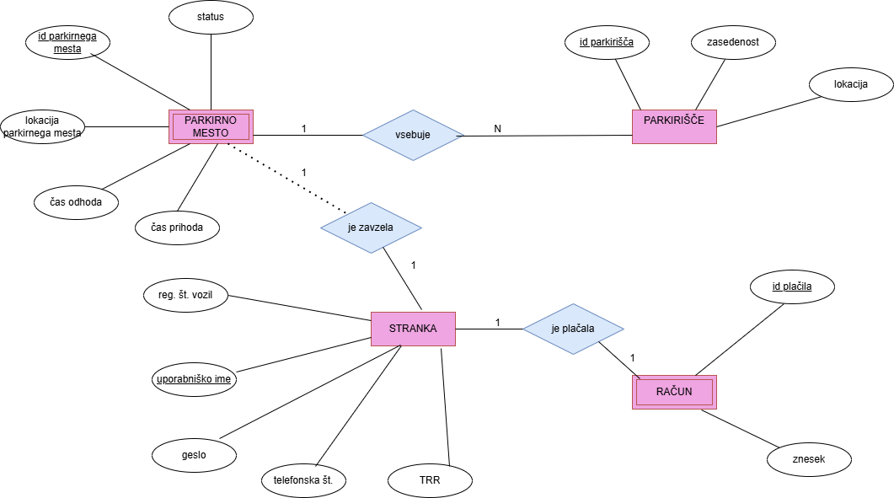

<h1>Aplikacija za parkiranje</h1>

Za uporabo aplikacije morajo uporabniki najprej ustvariti svoj račun. Po uspešni registraciji pridobijo dostop do informacij o lokacijah parkirišč ter trenutni zasedenosti posameznih parkirnih mest. Tako lahko enostavno preverijo, kje je na voljo prosto mesto, ter si v realnem času zagotovijo parkirno mesto glede na svojo lokacijo ali potrebe.
Ob parkiranju uporabnik preko aplikacije zabeleži čas prihoda, s čimer se izbrano parkirno mesto označi kot zasedeno. 

<h3>ER diagram</h3>

